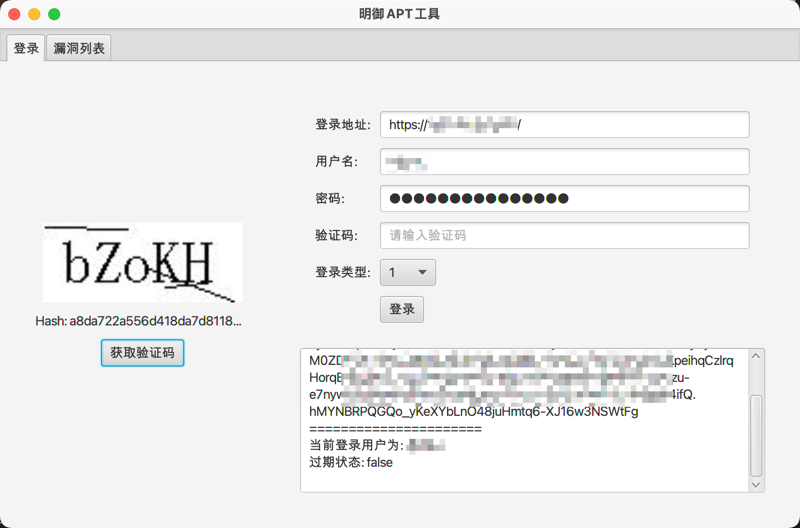
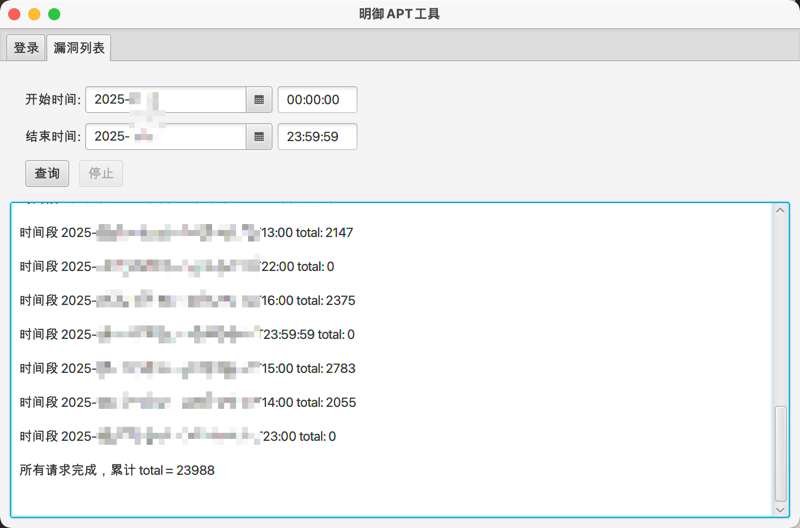

# dbapp-apt-analyzer

自用明御APT解析工具，目前实现了第三方登录和统计告警

## 项目介绍

_傻波一明御APT，这玩意谁研究的，超过1w条数据就显示不了，统计一天的数据还得反复调时间一个小时一个小时的统计，受不了了写了个小工具_

### 第三方登录

这里注意配置文件存储的密码是明文，所以外发的时候小心了

什么，你问我为什么不写加密？~~因为我懒~~ 明御登录的时候还得拿明文密码加密一次，抠了半天前端才抠出来

### 分时段统计告警数量

默认统计所有级别（高、中、低）

### 后记

目前只是方便自己用，其他的功能需要用到的时候再加吧